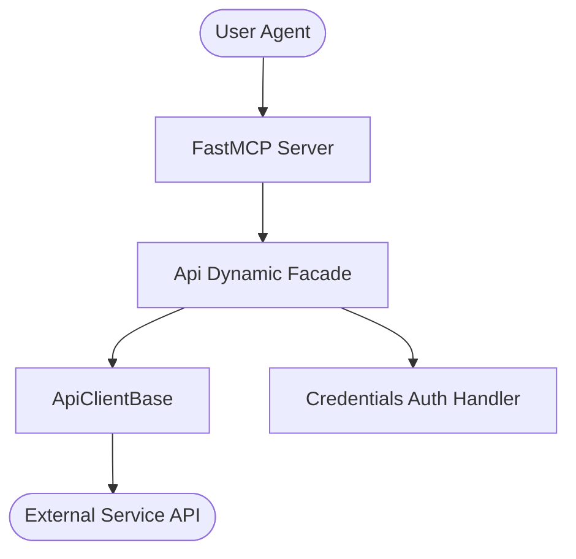

# Mattermost MCP

[](https://github.com/genius-agents/mattermost-mcp)
[](pyproject.toml)
[](LICENSE)

Mattermost enterprise messaging collaboration server. Built with the highest architectural standards, incorporating dynamic facades, custom API routing, and FastMCP tool decoration.

> **Documentation** — Installation, deployment, usage across the API, CLI, and MCP
> interfaces, the companion agent server, and guidance for provisioning the Mattermost
> platform are maintained in the
> [official documentation](https://knuckles-team.github.io/mattermost-mcp/).

## Table of Contents
- [Overview](#overview)
- [Features](#features)
- [Installation](#installation)
- [Usage](#usage)
- [Environment Variables](#environment-variables)
- [MCP Tools](#mcp-tools)
- [Architecture](#architecture)
- [Deployment](#deployment)
- [Contributing](#contributing)
- [License](#license)

---

## Overview

Mattermost MCP provides a high-performance, model-optimized interface to Mattermost capabilities. It isolates the model from underlying API transport complexity, ensuring safe, idempotent, and highly traceable system interactions.

---

## Features

- **Dynamic Facade Orchestration**: Integrates multi-inheritance clients cleanly under a single facade.
- **Battle-Tested Resilience**: Out-of-the-box credential authentication, connection polling, and request retry strategies.
- **FastMCP Declarative Tools**: Fast, native schema registration with full inline validation.
- **Complete Test Intent Diversity**: Deep, automated unit, integration, and mock tests ensuring high code coverage.

---

## ⚙️ Dynamic Tool Selection & Visibility

This MCP server supports dynamic toolset selection and visibility filtering at runtime. This allows you to restrict the set of exposed tools in order to prevent blowing up the LLM's context window.

You can configure tool filtering via multiple input channels:

- **CLI Arguments:** Pass `--tools` or `--toolsets` (or their disabled counterparts `--disabled-tools` and `--disabled-toolsets`) during startup.
- **Environment Variables:** Define standard environment variables:
  - `MCP_ENABLED_TOOLS` / `MCP_DISABLED_TOOLS`
  - `MCP_ENABLED_TAGS` / `MCP_DISABLED_TAGS`
- **HTTP SSE Request Headers:** Pass custom headers during transport initialization:
  - `x-mcp-enabled-tools` / `x-mcp-disabled-tools`
  - `x-mcp-enabled-tags` / `x-mcp-disabled-tags`
- **HTTP SSE Request Query Parameters:** Append query parameters directly to your transport connection URL:
  - `?tools=tool1,tool2`
  - `?tags=tag1`

When query strings or parameters are supplied, an LLM-free **Knowledge Graph resolution layer** (using `DynamicToolOrchestrator`) matches query intents against known tool tags, names, or descriptions, with safe fallback and automated 24-hour background cache refreshing.


---

## Installation

Pick the extra that matches what you want to run:

| Extra | Installs | Use when |
|-------|----------|----------|
| `mattermost-mcp[mcp]` | Slim MCP server only (`agent-utilities[mcp]` — FastMCP/FastAPI) | You only run the **MCP server** (smallest install / image) |
| `mattermost-mcp[agent]` | Full agent runtime (`agent-utilities[agent,logfire]` — Pydantic AI + the epistemic-graph engine) | You run the **integrated agent** |
| `mattermost-mcp[all]` | Everything (`mcp` + `agent` + `logfire`) | Development / both surfaces |

```bash
# MCP server only (recommended for tool hosting — slim deps)
uv pip install "mattermost-mcp[mcp]"

# Full agent runtime (Pydantic AI + epistemic-graph engine)
uv pip install "mattermost-mcp[agent]"

# Everything (development)
uv pip install "mattermost-mcp[all]"      # or: python -m pip install "mattermost-mcp[all]"
```

### Container images (`:mcp` vs `:agent`)

One multi-stage `docker/Dockerfile` builds two right-sized images, selected by `--target`:

| Image tag | Build target | Contents | Entrypoint |
|-----------|--------------|----------|------------|
| `knucklessg1/mattermost-mcp:mcp` | `--target mcp` | `mattermost-mcp[mcp]` — **slim**, no engine/`pydantic-ai`/`dspy`/`llama-index`/`tree-sitter` | `mattermost-mcp` |
| `knucklessg1/mattermost-mcp:latest` | `--target agent` (default) | `mattermost-mcp[agent]` — **full** agent runtime + epistemic-graph engine | `mattermost-agent` |

```bash
docker build --target mcp   -t knucklessg1/mattermost-mcp:mcp    docker/   # slim MCP server
docker build --target agent -t knucklessg1/mattermost-mcp:latest docker/   # full agent
```

`docker/mcp.compose.yml` runs the slim `:mcp` server; `docker/agent.compose.yml` runs the
agent (`:latest`) with a co-located `:mcp` sidecar.

### Knowledge-graph database (`epistemic-graph`)

The **full agent** (`[agent]` / `:latest`) embeds the **epistemic-graph** engine (pulled in
transitively via `agent-utilities[agent]`). For production — or to share one knowledge graph
across multiple agents — run **epistemic-graph as its own database container** and point the
agent at it instead of embedding it. Deployment recipes (single-node + Raft HA), connection
config, and the full database architecture (with diagrams) are documented in the
[epistemic-graph deployment guide](https://knuckles-team.github.io/epistemic-graph/deployment/).
The slim `[mcp]` server does **not** require the database.

---

## Usage

You can launch the FastMCP server in stdio mode via Python module execution:

```python
import asyncio
from mattermost_mcp.mcp_server import get_mcp_instance

async def main():
    mcp = get_mcp_instance()
    # Execute stdio loop or launch server
    print("MCP Server ready.")

if __name__ == "__main__":
    asyncio.run(main())
```

For direct shell launch, execute:

```bash
python -m mattermost_mcp.mcp_server
```

---

## Environment Variables

<!-- ENV-VARS-TABLE:START -->

#### Package environment variables

| Variable | Example | Description |
|----------|---------|-------------|
| `MATTERMOST_URL` | `http://localhost:8065` | Mattermost Server API v4 endpoint URL |
| `MATTERMOST_TOKEN` | `mattermost_api_access_token` | Personal Access Token or Bot Token |
| `ACCESS_CONTROLTOOL` | `True` | MCP tools table (condensed action-routed surface). |
| `ACTIONSTOOL` | `True` |  |
| `AGENTSTOOL` | `True` |  |
| `AUDIT_LOGGINGTOOL` | `True` |  |
| `BOARDSTOOL` | `True` |  |
| `BOOKMARKSTOOL` | `True` |  |
| `BOTSTOOL` | `True` |  |
| `BRANDTOOL` | `True` |  |
| `CHANNELSTOOL` | `True` |  |
| `CLOUDTOOL` | `True` |  |
| `CLUSTERTOOL` | `True` |  |
| `COMMANDSTOOL` | `True` |  |
| `COMPLIANCETOOL` | `True` |  |
| `CONTENT_FLAGGINGTOOL` | `True` |  |
| `CUSTOM_PROFILE_ATTRIBUTESTOOL` | `True` |  |
| `DATARETENTIONTOOL` | `True` |  |
| `ELASTICSEARCHTOOL` | `True` |  |
| `EMOJITOOL` | `True` |  |
| `EXPORTSTOOL` | `True` |  |
| `FILESTOOL` | `True` |  |
| `GROUPSTOOL` | `True` |  |
| `IMPORTSTOOL` | `True` |  |
| `IP_FILTERSTOOL` | `True` |  |
| `JOBSTOOL` | `True` |  |
| `LDAPTOOL` | `True` |  |
| `LIMITSTOOL` | `True` |  |
| `LOGSTOOL` | `True` |  |
| `METRICSTOOL` | `True` |  |
| `OAUTHTOOL` | `True` |  |
| `OUTGOING_OAUTH_CONNECTIONSTOOL` | `True` |  |
| `PERMISSIONSTOOL` | `True` |  |
| `PLUGINSTOOL` | `True` |  |
| `POSTSTOOL` | `True` |  |
| `PREFERENCESTOOL` | `True` |  |
| `PROPERTIESTOOL` | `True` |  |
| `REACTIONSTOOL` | `True` |  |
| `RECAPSTOOL` | `True` |  |
| `REMOTECLUSTERSTOOL` | `True` |  |
| `REPORTSTOOL` | `True` |  |
| `ROLESTOOL` | `True` |  |
| `SAMLTOOL` | `True` |  |
| `SCHEDULED_POSTTOOL` | `True` |  |
| `SCHEMESTOOL` | `True` |  |
| `SERVICE_TERMSTOOL` | `True` |  |
| `SHAREDCHANNELSTOOL` | `True` |  |
| `STATUSTOOL` | `True` |  |
| `SYSTEMTOOL` | `True` |  |
| `TEAMSTOOL` | `True` |  |
| `UPLOADSTOOL` | `True` |  |
| `USAGETOOL` | `True` |  |
| `USERSTOOL` | `True` |  |
| `VIEWSTOOL` | `True` |  |
| `WEBHOOKSTOOL` | `True` |  |

#### Inherited agent-utilities variables (apply to every connector)

| Variable | Example | Description |
|----------|---------|-------------|
| `TRANSPORT` | `stdio` | MCP transport: `stdio` | `streamable-http` | `sse` |
| `HOST` | `0.0.0.0` | Bind host (HTTP transports) |
| `PORT` | `8000` | Bind port (HTTP transports) |
| `MCP_TOOL_MODE` | `condensed` | Tool surface: `condensed` | `verbose` | `both` |
| `MCP_ENABLED_TOOLS` | — | Comma-separated tool allow-list |
| `MCP_DISABLED_TOOLS` | — | Comma-separated tool deny-list |
| `MCP_ENABLED_TAGS` | — | Comma-separated tag allow-list |
| `MCP_DISABLED_TAGS` | — | Comma-separated tag deny-list |
| `EUNOMIA_TYPE` | `none` | Authorization mode: `none` | `embedded` | `remote` |
| `EUNOMIA_POLICY_FILE` | `mcp_policies.json` | Embedded Eunomia policy file |
| `EUNOMIA_REMOTE_URL` | — | Remote Eunomia authorization server URL |
| `ENABLE_OTEL` | `False` | Enable OpenTelemetry export |
| `OTEL_EXPORTER_OTLP_ENDPOINT` | — | OTLP collector endpoint |
| `MCP_CLIENT_AUTH` | — | Outbound MCP auth (`oidc-client-credentials` for fleet calls) |
| `OIDC_CLIENT_ID` | — | OIDC client id (service-account auth) |
| `OIDC_CLIENT_SECRET` | — | OIDC client secret (service-account auth) |
| `DEBUG` | `False` | Verbose logging |
| `PYTHONUNBUFFERED` | `1` | Unbuffered stdout (recommended in containers) |
| `MCP_URL` | `http://localhost:8000/mcp` | URL of the MCP server the agent connects to |
| `PROVIDER` | `openai` | LLM provider for the agent |
| `MODEL_ID` | `gpt-4o` | Model id for the agent |
| `ENABLE_WEB_UI` | `True` | Serve the AG-UI web interface |

_55 package + 22 inherited variable(s). Auto-generated from `.env.example` + the shared agent-utilities set — do not edit._
<!-- ENV-VARS-TABLE:END -->


Every variable the server reads. A local template is supplied inside
[.env.example](.env.example) — copy it to `.env` and fill in your endpoint/credentials.

### Connection & Credentials
| Variable | Description | Default |
|----------|-------------|---------|
| `MATTERMOST_URL` | Mattermost Server API v4 endpoint URL | `http://localhost:8065` |
| `MATTERMOST_TOKEN` | Personal Access Token or Bot Token | — |

### MCP server / transport
| Variable | Description | Default |
|----------|-------------|---------|
| `TRANSPORT` | `stdio`, `streamable-http`, or `sse` | `stdio` |
| `HOST` | Bind host (HTTP transports) | `0.0.0.0` |
| `PORT` | Bind port (HTTP transports) | `8000` |
| `MCP_TOOL_MODE` | Tool surface: `condensed`, `verbose`, or `both` | `condensed` |
| `MCP_ENABLED_TOOLS` / `MCP_DISABLED_TOOLS` | Comma-separated tool allow/deny list | — |
| `MCP_ENABLED_TAGS` / `MCP_DISABLED_TAGS` | Comma-separated tag allow/deny list | — |
| `DEBUG` | Verbose logging | `False` |
| `PYTHONUNBUFFERED` | Unbuffered stdout (recommended in containers) | `1` |

### Tool toggles
Each action-routed tool can be disabled individually via its toggle env var (set to `false`).
The full list is in the [MCP Tools](#mcp-tools) table above (e.g. `CHANNELSTOOL`, `POSTSTOOL`,
`USERSTOOL`, `TEAMSTOOL`).

### Agent CLI (full `[agent]` runtime only)
| Variable | Description | Default |
|----------|-------------|---------|
| `MCP_URL` | URL of the MCP server the agent connects to | `http://localhost:8000/mcp` |
| `PROVIDER` | LLM provider (e.g. `openai`) | `openai` |
| `MODEL_ID` | Model id (e.g. `gpt-4o`) | `gpt-4o` |
| `ENABLE_WEB_UI` | Serve the AG-UI web interface | `True` |

---

## MCP Tools

The following declarative FastMCP tools are registered and available to upstream AI agents:

<!-- This table is auto-generated by `python -m agent_utilities.mcp.readme_tools` — do not edit by hand. -->

<!-- MCP-TOOLS-TABLE:START -->

| MCP Tool | Toggle Env Var | Description |
|----------|----------------|-------------|
| `mattermost_mcp_access_control` | `ACCESS_CONTROLTOOL` | Manage Mattermost MCP access_control operations. |
| `mattermost_mcp_actions` | `ACTIONSTOOL` | Manage Mattermost MCP actions operations. |
| `mattermost_mcp_agents` | `AGENTSTOOL` | Manage Mattermost MCP agents operations. |
| `mattermost_mcp_audit_logging` | `AUDIT_LOGGINGTOOL` | Manage Mattermost MCP audit_logging operations. |
| `mattermost_mcp_boards` | `BOARDSTOOL` | Manage Mattermost MCP boards operations. |
| `mattermost_mcp_bookmarks` | `BOOKMARKSTOOL` | Manage Mattermost MCP bookmarks operations. |
| `mattermost_mcp_bots` | `BOTSTOOL` | Manage Mattermost MCP bots operations. |
| `mattermost_mcp_brand` | `BRANDTOOL` | Manage Mattermost MCP brand operations. |
| `mattermost_mcp_channels` | `CHANNELSTOOL` | Manage Mattermost MCP channels operations. |
| `mattermost_mcp_cloud` | `CLOUDTOOL` | Manage Mattermost MCP cloud operations. |
| `mattermost_mcp_cluster` | `CLUSTERTOOL` | Manage Mattermost MCP cluster operations. |
| `mattermost_mcp_commands` | `COMMANDSTOOL` | Manage Mattermost MCP commands operations. |
| `mattermost_mcp_compliance` | `COMPLIANCETOOL` | Manage Mattermost MCP compliance operations. |
| `mattermost_mcp_content_flagging` | `CONTENT_FLAGGINGTOOL` | Manage Mattermost MCP content_flagging operations. |
| `mattermost_mcp_custom_profile_attributes` | `CUSTOM_PROFILE_ATTRIBUTESTOOL` | Manage Mattermost MCP custom_profile_attributes operations. |
| `mattermost_mcp_dataretention` | `DATARETENTIONTOOL` | Manage Mattermost MCP dataretention operations. |
| `mattermost_mcp_elasticsearch` | `ELASTICSEARCHTOOL` | Manage Mattermost MCP elasticsearch operations. |
| `mattermost_mcp_emoji` | `EMOJITOOL` | Manage Mattermost MCP emoji operations. |
| `mattermost_mcp_exports` | `EXPORTSTOOL` | Manage Mattermost MCP exports operations. |
| `mattermost_mcp_files` | `FILESTOOL` | Manage Mattermost MCP files operations. |
| `mattermost_mcp_groups` | `GROUPSTOOL` | Manage Mattermost MCP groups operations. |
| `mattermost_mcp_imports` | `IMPORTSTOOL` | Manage Mattermost MCP imports operations. |
| `mattermost_mcp_ip_filters` | `IP_FILTERSTOOL` | Manage Mattermost MCP ip_filters operations. |
| `mattermost_mcp_jobs` | `JOBSTOOL` | Manage Mattermost MCP jobs operations. |
| `mattermost_mcp_ldap` | `LDAPTOOL` | Manage Mattermost MCP ldap operations. |
| `mattermost_mcp_limits` | `LIMITSTOOL` | Manage Mattermost MCP limits operations. |
| `mattermost_mcp_logs` | `LOGSTOOL` | Manage Mattermost MCP logs operations. |
| `mattermost_mcp_metrics` | `METRICSTOOL` | Manage Mattermost MCP metrics operations. |
| `mattermost_mcp_oauth` | `OAUTHTOOL` | Manage Mattermost MCP oauth operations. |
| `mattermost_mcp_outgoing_oauth_connections` | `OUTGOING_OAUTH_CONNECTIONSTOOL` | Manage Mattermost MCP outgoing_oauth_connections operations. |
| `mattermost_mcp_permissions` | `PERMISSIONSTOOL` | Manage Mattermost MCP permissions operations. |
| `mattermost_mcp_plugins` | `PLUGINSTOOL` | Manage Mattermost MCP plugins operations. |
| `mattermost_mcp_posts` | `POSTSTOOL` | Manage Mattermost MCP posts operations. |
| `mattermost_mcp_preferences` | `PREFERENCESTOOL` | Manage Mattermost MCP preferences operations. |
| `mattermost_mcp_properties` | `PROPERTIESTOOL` | Manage Mattermost MCP properties operations. |
| `mattermost_mcp_reactions` | `REACTIONSTOOL` | Manage Mattermost MCP reactions operations. |
| `mattermost_mcp_recaps` | `RECAPSTOOL` | Manage Mattermost MCP recaps operations. |
| `mattermost_mcp_remoteclusters` | `REMOTECLUSTERSTOOL` | Manage Mattermost MCP remoteclusters operations. |
| `mattermost_mcp_reports` | `REPORTSTOOL` | Manage Mattermost MCP reports operations. |
| `mattermost_mcp_roles` | `ROLESTOOL` | Manage Mattermost MCP roles operations. |
| `mattermost_mcp_saml` | `SAMLTOOL` | Manage Mattermost MCP saml operations. |
| `mattermost_mcp_scheduled_post` | `SCHEDULED_POSTTOOL` | Manage Mattermost MCP scheduled_post operations. |
| `mattermost_mcp_schemes` | `SCHEMESTOOL` | Manage Mattermost MCP schemes operations. |
| `mattermost_mcp_service_terms` | `SERVICE_TERMSTOOL` | Manage Mattermost MCP service_terms operations. |
| `mattermost_mcp_sharedchannels` | `SHAREDCHANNELSTOOL` | Manage Mattermost MCP sharedchannels operations. |
| `mattermost_mcp_status` | `STATUSTOOL` | Manage Mattermost MCP status operations. |
| `mattermost_mcp_system` | `SYSTEMTOOL` | Manage Mattermost MCP system operations. |
| `mattermost_mcp_teams` | `TEAMSTOOL` | Manage Mattermost MCP teams operations. |
| `mattermost_mcp_uploads` | `UPLOADSTOOL` | Manage Mattermost MCP uploads operations. |
| `mattermost_mcp_usage` | `USAGETOOL` | Manage Mattermost MCP usage operations. |
| `mattermost_mcp_users` | `USERSTOOL` | Manage Mattermost MCP users operations. |
| `mattermost_mcp_views` | `VIEWSTOOL` | Manage Mattermost MCP views operations. |
| `mattermost_mcp_webhooks` | `WEBHOOKSTOOL` | Manage Mattermost MCP webhooks operations. |

_53 action-routed tools (default `MCP_TOOL_MODE=condensed`). Each is enabled unless its toggle is set false; set `MCP_TOOL_MODE=verbose` (or `both`) for the 1:1 per-operation surface. Auto-generated — do not edit._
<!-- MCP-TOOLS-TABLE:END -->

See [docs/overview.md](docs/overview.md) or [docs/concepts.md](docs/concepts.md) for deeper operational examples.

---

## Architecture

This package uses the standardized Agent-Utilities dynamic facade architecture:



---

## Deployment

### Bare-Metal (Standard pip)
1. Set up your Python virtual environment (>= 3.10).
2. Install the package: `pip install .[all]`
3. Export credentials:
   ```bash
   export MATTERMOST_URL="http://localhost:8065"
   ```
4. Run: `python -m mattermost_mcp.mcp_server`

### Container (Docker Compose)
A standard compose structure is provided inside the `docker/` folder. Build and deploy:

```bash
docker compose -f docker/compose.yml up --build -d
```

---

<!-- BEGIN GENERATED: additional-deployment-options -->
### Additional Deployment Options

`mattermost-mcp` can also run as a **local container** (Docker / Podman / `uv`) or be
consumed from a **remote deployment**. The
[Deployment guide](https://knuckles-team.github.io/mattermost-mcp/deployment/) has full, copy-paste
`mcp_config.json` for all four transports — **stdio**, **streamable-http**,
**local container / uv**, and **remote URL**:

- **Local container / uv** — launch the server from `mcp_config.json` via `uvx`,
  `docker run`, or `podman run`, or point at a local streamable-http container by `url`.
- **Remote URL** — connect to a server deployed behind Caddy at
  `http://mattermost-mcp.arpa/mcp` using the `"url"` key.
<!-- END GENERATED: additional-deployment-options -->

## Documentation

The complete documentation is published as the
[official documentation site](https://knuckles-team.github.io/mattermost-mcp/) and is
the recommended reference for installation, deployment, and day-to-day operation.

| Page | Contents |
|---|---|
| [Installation](https://knuckles-team.github.io/mattermost-mcp/installation/) | pip, source, extras, prebuilt Docker image |
| [Deployment](https://knuckles-team.github.io/mattermost-mcp/deployment/) | run the MCP server and agent, Compose, Caddy + Technitium, env config |
| [Usage](https://knuckles-team.github.io/mattermost-mcp/usage/) | the MCP tools, the `Api` client, the CLI |
| [Backing Platform](https://knuckles-team.github.io/mattermost-mcp/platform/) | deploy Mattermost with Docker |
| [Overview](https://knuckles-team.github.io/mattermost-mcp/overview/) | dynamic facade and FastMCP integration |
| [Architecture](https://knuckles-team.github.io/mattermost-mcp/architecture/) | dynamic facade, FastMCP, agent server |
| [Concepts](https://knuckles-team.github.io/mattermost-mcp/concepts/) | concept registry (`CONCEPT:MM-*`) |

---

## Contributing

Please audit all code changes against ecosystem guidelines in [CONTRIBUTING.md](CONTRIBUTING.md) if available, and run:

```bash
pre-commit run --all-files
```

---

## License

This project is licensed under the MIT License. See the [LICENSE](LICENSE) file for complete details.


<!-- BEGIN agent-os-genesis-deploy (generated; do not edit between markers) -->

## Deploy with `agent-os-genesis`

This package can be provisioned for you — skill-guided — by the **`agent-os-genesis`**
universal skill (its *single-package deploy mode*): it picks your install method, seeds
secrets to OpenBao/Vault (or `.env`), trusts your enterprise CA, registers the MCP
server, and verifies it — the same machinery that stands up the whole Agent OS, narrowed
to just this package. Ask your agent to **"deploy `mattermost-mcp` with agent-os-genesis"**.

| Install mode | Command |
|------|---------|
| Bare-metal, prod (PyPI) | `uvx mattermost-mcp` · or `uv tool install mattermost-mcp` |
| Bare-metal, dev (editable) | `uv pip install -e ".[all]"` · or `pip install -e ".[all]"` |
| Container, prod | deploy `knucklessg1/mattermost-mcp:latest` via docker-compose / swarm / podman / podman-compose / kubernetes |
| Container, dev (editable) | deploy `docker/compose.dev.yml` (source-mounted at `/src`; edits live on restart) |

Secrets are read-existing + seeded via `vault_sync` — you are only prompted for what's missing.

<!-- END agent-os-genesis-deploy -->
