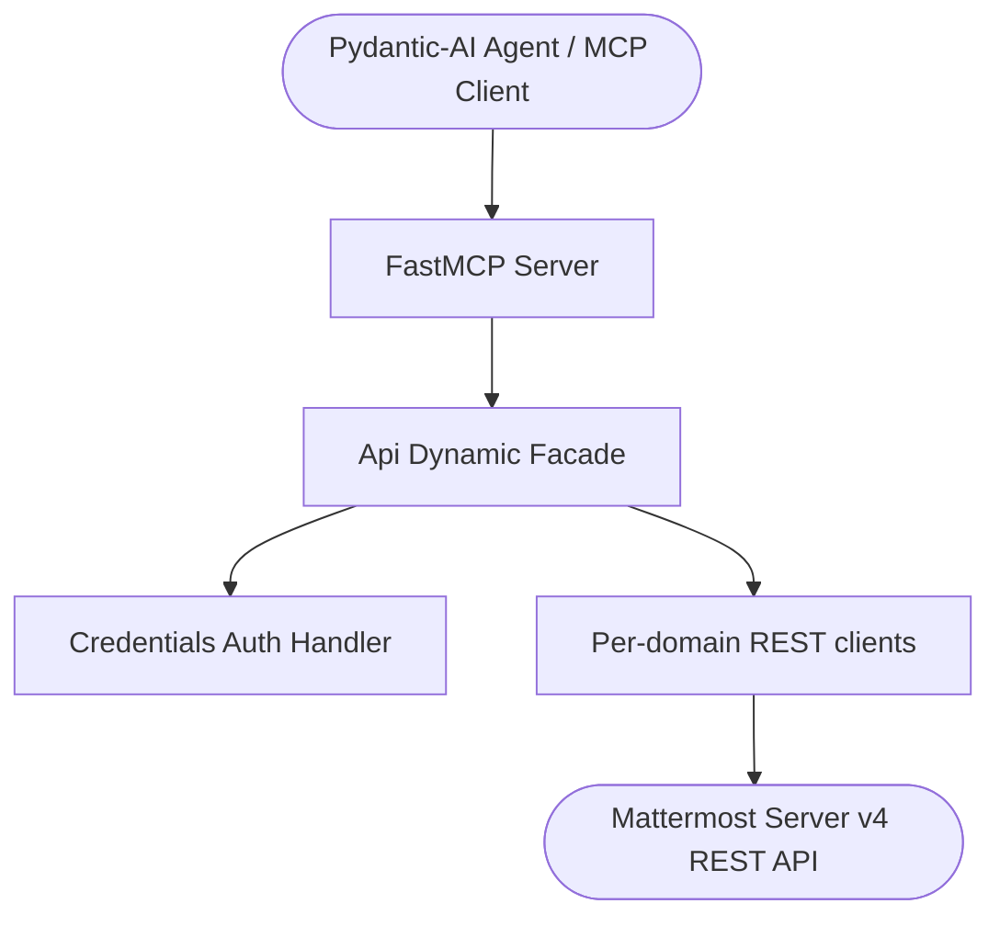
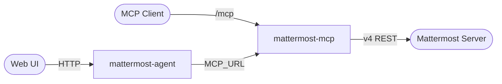

# Architecture

`mattermost-mcp` follows the standardized agent-utilities **dynamic-facade**
architecture: a multi-inheritance REST client under one `Api` object, a thin FastMCP
tool layer, and an optional Pydantic-AI agent server that consumes the MCP tools.

## Layers

- **`mattermost_mcp.api_client.Api`** — the dynamic facade. It composes the per-domain
  Mattermost clients (channels, teams, posts, users, bots, files, and the full
  administrative surface) into a single object. All REST transport, credential
  handling, and request behavior live here.
- **`mattermost_mcp.auth.get_client()`** — builds an `Api` from `MATTERMOST_URL` /
  `MATTERMOST_TOKEN` in the environment.
- **`mattermost_mcp.mcp_server`** — registers FastMCP tools (one `register_*_tools`
  module per domain) tagged under the `MM` prefix. The tool layer adds no business
  logic; it delegates to the `Api` facade. Runtime toolset selection and visibility
  filtering keep the model's context window lean.
- **`mattermost_mcp.agent_server`** — the Pydantic-AI agent (`mattermost-agent`),
  which connects to the running MCP server over `MCP_URL` and can serve a web UI.

## Request flow

## Deployment topology

See [Deployment](deployment.md) for the Compose stacks, the agent server, the Caddy
reverse proxy, and DNS, and [Concepts](concepts.md) for the `CONCEPT:MM-*` registry.
